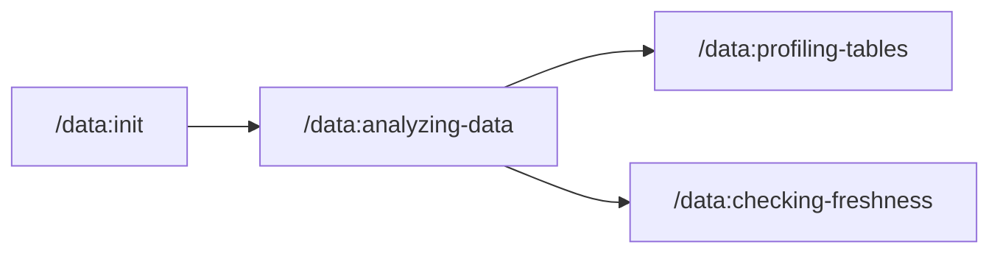
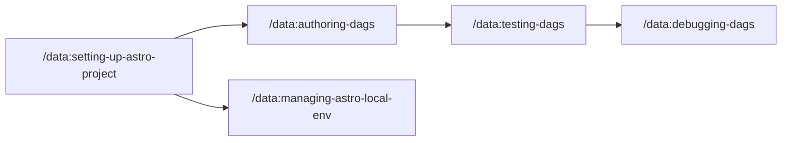

# agents

AI agent tooling for data engineering workflows. Includes an [MCP server](./astro-airflow-mcp/) for Airflow, a [CLI tool (`af`)](./astro-airflow-mcp/README.md#airflow-cli-tool) for interacting with Airflow from your terminal, and [skills](#skills) that extend AI coding agents with specialized capabilities for working with Airflow and data warehouses. Works with [Claude Code](https://docs.anthropic.com/en/docs/claude-code), [Cursor](https://cursor.com), and other agentic coding tools.

Built by [Astronomer](https://www.astronomer.io/). [Apache 2.0 licensed](https://github.com/astronomer/agents/blob/main/LICENSE) and compatible with open-source Apache Airflow.

## Table of Contents

<!-- START doctoc generated TOC please keep comment here to allow auto update -->
<!-- DON'T EDIT THIS SECTION, INSTEAD RE-RUN doctoc TO UPDATE -->

- [Installation](#installation)
  - [Quick Start](#quick-start)
  - [Compatibility](#compatibility)
  - [Claude Code](#claude-code)
  - [Cursor](#cursor)
  - [Other MCP Clients](#other-mcp-clients)
- [Features](#features)
  - [MCP Server](#mcp-server)
  - [Skills](#skills)
  - [User Journeys](#user-journeys)
  - [Airflow CLI (`af`)](#airflow-cli-af)
- [Configuration](#configuration)
  - [Warehouse Connections](#warehouse-connections)
  - [Airflow](#airflow)
- [Usage](#usage)
  - [Getting Started](#getting-started)
- [Development](#development)
  - [Local Development Setup](#local-development-setup)
  - [Adding Skills](#adding-skills)
- [Troubleshooting](#troubleshooting)
  - [Common Issues](#common-issues)
- [Contributing](#contributing)
- [Roadmap](#roadmap)
- [License](#license)

<!-- END doctoc generated TOC please keep comment here to allow auto update -->

## Installation

### Quick Start

```bash
npx skills add astronomer/agents
```

This installs Astronomer skills into your project via [skills.sh](https://skills.sh). Works with Claude Code, Cursor, and other AI coding tools.

### Compatibility

**Skills:** Works with [25+ AI coding agents](https://github.com/vercel-labs/add-skill?tab=readme-ov-file#available-agents) including Claude Code, Cursor, VS Code (GitHub Copilot), Windsurf, Cline, and more.

**MCP Server:** Works with any [MCP-compatible client](https://modelcontextprotocol.io/clients) including Claude Desktop, VS Code, and others.

### Claude Code

```bash
# Add the marketplace and install the plugin
claude plugin marketplace add astronomer/agents
claude plugin install data@astronomer
```

The plugin includes the Airflow MCP server that runs via `uvx` from PyPI. Data warehouse queries are handled by the `analyzing-data` skill using a background Jupyter kernel.

### Cursor

Cursor supports both MCP servers and skills.

**MCP Server** - Click to install:

<a href="https://cursor.com/en-US/install-mcp?name=astro-airflow-mcp&config=eyJjb21tYW5kIjoidXZ4IiwiYXJncyI6WyJhc3Ryby1haXJmbG93LW1jcCIsIi0tdHJhbnNwb3J0Iiwic3RkaW8iXX0"></a>

**Skills** - Install to your project:

```bash
npx skills add astronomer/agents
```

This installs skills to `.cursor/skills/` in your project.

<details>
<summary>Manual MCP configuration</summary>

Add to `~/.cursor/mcp.json`:

```json
{
  "mcpServers": {
    "airflow": {
      "command": "uvx",
      "args": ["astro-airflow-mcp", "--transport", "stdio"]
    }
  }
}
```

</details>

<details>
<summary>Enable hooks (skill suggestions, session management)</summary>

Create `.cursor/hooks.json` in your project:

```json
{
  "version": 1,
  "hooks": {
    "beforeSubmitPrompt": [
      {
        "command": "$CURSOR_PROJECT_DIR/.cursor/skills/airflow/hooks/airflow-skill-suggester.sh",
        "timeout": 5
      }
    ],
    "stop": [
      {
        "command": "uv run $CURSOR_PROJECT_DIR/.cursor/skills/analyzing-data/scripts/cli.py stop",
        "timeout": 10
      }
    ]
  }
}
```

**What these hooks do:**
- `beforeSubmitPrompt`: Suggests data skills when you mention Airflow keywords
- `stop`: Cleans up kernel when session ends

</details>

### Other MCP Clients

For any MCP-compatible client (Claude Desktop, VS Code, etc.):

```bash
# Airflow MCP
uvx astro-airflow-mcp --transport stdio

# With remote Airflow
AIRFLOW_API_URL=https://your-airflow.example.com \
AIRFLOW_USERNAME=admin \
AIRFLOW_PASSWORD=admin \
uvx astro-airflow-mcp --transport stdio
```

## Features

The `data` plugin bundles an MCP server and skills into a single installable package.

### MCP Server

| Server | Description |
|--------|-------------|
| **[Airflow](https://github.com/astronomer/agents/tree/main/astro-airflow-mcp)** | Full Airflow REST API integration via [astro-airflow-mcp](https://github.com/astronomer/agents/tree/main/astro-airflow-mcp): DAG management, triggering, task logs, system health |

### Skills

#### Data Discovery & Analysis

| Skill | Description |
|-------|-------------|
| [init](./skills/init/) | Initialize schema discovery - generates `.astro/warehouse.md` for instant lookups |
| [analyzing-data](./skills/analyzing-data/) | SQL-based analysis to answer business questions (uses background Jupyter kernel) |
| [checking-freshness](./skills/checking-freshness/) | Check how current your data is |
| [profiling-tables](./skills/profiling-tables/) | Comprehensive table profiling and quality assessment |

#### Data Lineage

| Skill | Description |
|-------|-------------|
| [tracing-downstream-lineage](./skills/tracing-downstream-lineage/) | Analyze what breaks if you change something |
| [tracing-upstream-lineage](./skills/tracing-upstream-lineage/) | Trace where data comes from |
| [annotating-task-lineage](./skills/annotating-task-lineage/) | Add manual lineage to tasks using inlets/outlets |
| [creating-openlineage-extractors](./skills/creating-openlineage-extractors/) | Build custom OpenLineage extractors for operators |

#### DAG Development

| Skill | Description |
|-------|-------------|
| [airflow](./skills/airflow/) | Main entrypoint - routes to specialized Airflow skills |
| [setting-up-astro-project](./skills/setting-up-astro-project/) | Initialize and configure new Astro/Airflow projects |
| [managing-astro-local-env](./skills/managing-astro-local-env/) | Manage local Airflow environment (start, stop, logs, troubleshoot) |
| [authoring-dags](./skills/authoring-dags/) | Create and validate Airflow DAGs with best practices |
| [testing-dags](./skills/testing-dags/) | Test and debug Airflow DAGs locally |
| [debugging-dags](./skills/debugging-dags/) | Deep failure diagnosis and root cause analysis |

#### Migration

| Skill | Description |
|-------|-------------|
| [migrating-airflow-2-to-3](./skills/migrating-airflow-2-to-3/) | Migrate DAGs from Airflow 2.x to 3.x |

### User Journeys

#### Data Analysis Flow



1. **Initialize** (`/data:init`) - One-time setup to generate `warehouse.md` with schema metadata
2. **Analyze** (`/data:analyzing-data`) - Answer business questions with SQL
3. **Profile** (`/data:profiling-tables`) - Deep dive into specific tables for statistics and quality
4. **Check freshness** (`/data:checking-freshness`) - Verify data is up to date before using

#### DAG Development Flow



1. **Setup** (`/data:setting-up-astro-project`) - Initialize project structure and dependencies
2. **Environment** (`/data:managing-astro-local-env`) - Start/stop local Airflow for development
3. **Author** (`/data:authoring-dags`) - Write DAG code following best practices
4. **Test** (`/data:testing-dags`) - Run DAGs and fix issues iteratively
5. **Debug** (`/data:debugging-dags`) - Deep investigation for complex failures

### Airflow CLI (`af`)

The `af` command-line tool lets you interact with Airflow directly from your terminal. Install it with:

```bash
uvx --from astro-airflow-mcp af --help
```

For frequent use, add an alias to your shell config (`~/.bashrc` or `~/.zshrc`):

```bash
alias af='uvx --from astro-airflow-mcp af'
```

Then use it for quick operations like `af health`, `af dags list`, or `af runs trigger <dag_id>`.

See the [full CLI documentation](./astro-airflow-mcp/README.md#airflow-cli-tool) for all commands and instance management.

## Configuration

### Warehouse Connections

Configure data warehouse connections at `~/.astro/agents/warehouse.yml`:

```yaml
my_warehouse:
  type: snowflake
  account: ${SNOWFLAKE_ACCOUNT}
  user: ${SNOWFLAKE_USER}
  auth_type: private_key
  private_key_path: ~/.ssh/snowflake_key.p8
  private_key_passphrase: ${SNOWFLAKE_PRIVATE_KEY_PASSPHRASE}
  warehouse: COMPUTE_WH
  role: ANALYST
  databases:
    - ANALYTICS
    - RAW
```

Store credentials in `~/.astro/agents/.env`:

```bash
SNOWFLAKE_ACCOUNT=xyz12345
SNOWFLAKE_USER=myuser
SNOWFLAKE_PRIVATE_KEY_PASSPHRASE=your-passphrase-here  # Only required if using an encrypted private key
```

**Supported databases:**

| Type | Package | Description |
|------|---------|-------------|
| `snowflake` | Built-in | Snowflake Data Cloud |
| `postgres` | Built-in | PostgreSQL |
| `bigquery` | Built-in | Google BigQuery |
| `sqlalchemy` | Any SQLAlchemy driver | Auto-detects packages for 25+ databases (see below) |

<details>
<summary>Auto-detected SQLAlchemy databases</summary>

The connector automatically installs the correct driver packages for:

| Database | Dialect URL |
|----------|-------------|
| PostgreSQL | `postgresql://` or `postgres://` |
| MySQL | `mysql://` or `mysql+pymysql://` |
| MariaDB | `mariadb://` |
| SQLite | `sqlite:///` |
| SQL Server | `mssql+pyodbc://` |
| Oracle | `oracle://` |
| Redshift | `redshift://` |
| Snowflake | `snowflake://` |
| BigQuery | `bigquery://` |
| DuckDB | `duckdb:///` |
| Trino | `trino://` |
| ClickHouse | `clickhouse://` |
| CockroachDB | `cockroachdb://` |
| Databricks | `databricks://` |
| Amazon Athena | `awsathena://` |
| Cloud Spanner | `spanner://` |
| Teradata | `teradata://` |
| Vertica | `vertica://` |
| SAP HANA | `hana://` |
| IBM Db2 | `db2://` |

For unlisted databases, install the driver manually and use standard SQLAlchemy URLs.

</details>

<details>
<summary>Example configurations</summary>

```yaml
# PostgreSQL
my_postgres:
  type: postgres
  host: localhost
  port: 5432
  user: analyst
  password: ${POSTGRES_PASSWORD}
  database: analytics

# BigQuery
my_bigquery:
  type: bigquery
  project: my-gcp-project
  credentials_path: ~/.config/gcloud/service_account.json

# SQLAlchemy (any supported database)
my_duckdb:
  type: sqlalchemy
  url: duckdb:///path/to/analytics.duckdb
  databases: [main]

# Redshift (via SQLAlchemy)
my_redshift:
  type: sqlalchemy
  url: redshift+redshift_connector://${REDSHIFT_USER}:${REDSHIFT_PASSWORD}@${REDSHIFT_HOST}:5439/${REDSHIFT_DATABASE}
  databases: [my_database]
```

</details>

### Airflow

The Airflow MCP auto-discovers your project when you run Claude Code from an Airflow project directory (contains `airflow.cfg` or `dags/` folder).

For remote instances, set environment variables:

| Variable | Description |
|----------|-------------|
| `AIRFLOW_API_URL` | Airflow webserver URL |
| `AIRFLOW_USERNAME` | Username |
| `AIRFLOW_PASSWORD` | Password |
| `AIRFLOW_AUTH_TOKEN` | Bearer token (alternative to username/password) |

## Usage

Skills are invoked automatically based on what you ask. You can also invoke them directly with `/data:<skill-name>`.

### Getting Started

1. **Initialize your warehouse** (recommended first step):
   ```
   /data:init
   ```
   This generates `.astro/warehouse.md` with schema metadata for faster queries.

2. **Ask questions naturally**:
   - "What tables contain customer data?"
   - "Show me revenue trends by product"
   - "Create a DAG that loads data from S3 to Snowflake daily"
   - "Why did my etl_pipeline DAG fail yesterday?"

## Development

See [CLAUDE.md](./CLAUDE.md) for plugin development guidelines.

### Local Development Setup

```bash
# Clone the repo
git clone https://github.com/astronomer/agents.git
cd agents

# Test with local plugin
claude --plugin-dir .

# Or install from local marketplace
claude plugin marketplace add .
claude plugin install data@astronomer
```

### Adding Skills

Create a new skill in `skills/<name>/SKILL.md` with YAML frontmatter:

```yaml
---
name: my-skill
description: When to invoke this skill
---

# Skill instructions here...
```

After adding skills, reinstall the plugin:
```bash
claude plugin uninstall data@astronomer && claude plugin install data@astronomer
```

## Troubleshooting

### Common Issues

| Issue | Solution |
|-------|----------|
| Skills not appearing | Reinstall plugin: `claude plugin uninstall data@astronomer && claude plugin install data@astronomer` |
| Warehouse connection errors | Check credentials in `~/.astro/agents/.env` and connection config in `warehouse.yml` |
| Airflow not detected | Ensure you're running from a directory with `airflow.cfg` or a `dags/` folder |

## Contributing

Contributions welcome! Please read our [Code of Conduct](./CODE_OF_CONDUCT.md) and [Contributing Guide](./CONTRIBUTING.md) before getting started.

## Roadmap

Skills we're likely to build:

**DAG Operations**
- CI/CD pipelines for DAG deployment
- Performance optimization and tuning
- Monitoring and alerting setup
- Data quality and validation workflows

**Astronomer Open Source**
- [Cosmos](https://github.com/astronomer/astronomer-cosmos) - Run dbt projects as Airflow DAGs
- [DAG Factory](https://github.com/astronomer/dag-factory) - Generate DAGs from YAML
- Other open source projects we maintain

**Conference Learnings**
- Reviewing talks from Airflow Summit, Coalesce, Data Council, and other conferences to extract reusable skills and patterns

**Broader Data Practitioner Skills**
- Churn prediction, data modeling, ML training, and other workflows that span DE/DS/analytics roles

**Don't see a skill you want? [Open an issue](https://github.com/astronomer/agents/issues) or submit a PR!**

## License

Apache 2.0

---

Made with :heart: by Astronomer
